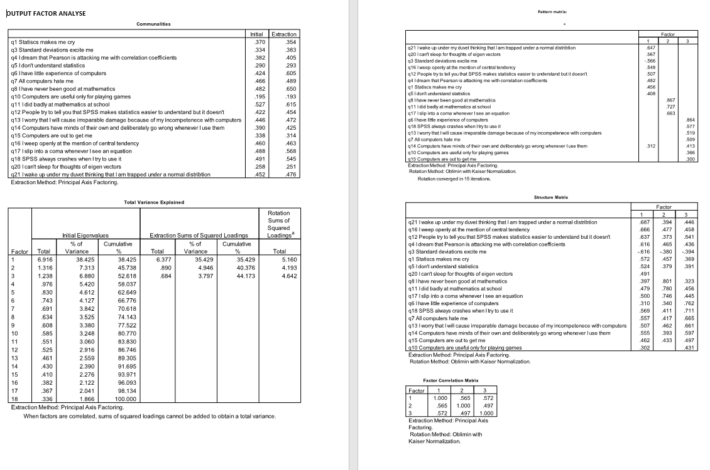

```{r, echo = FALSE, results = "hide"}
include_supplement("1658145900098.png")
```

Question
========
The following question relates to the attached output of a factor
analysis on items aimed at measuring students' fear of SPSS.  
  
What percentage of variance in q3 is explained by the extracted
factors?  


Answerlist
----------
* 6,9%
* 33,4%
* 38,3%
* 52,6%

Solution
========


Answerlist
----------
* False
* False
* True
* False

Meta-information
================
exname: vufsw-explained variance-2114-en
extype: schoice
exsolution: 0010
exshuffle: TRUE
exsection: factor analysis/explained variance
exextra[Type]: interpreting output
exextra[Program]: NA
exextra[Language]: English
exextra[Level]: statistical reasoning

