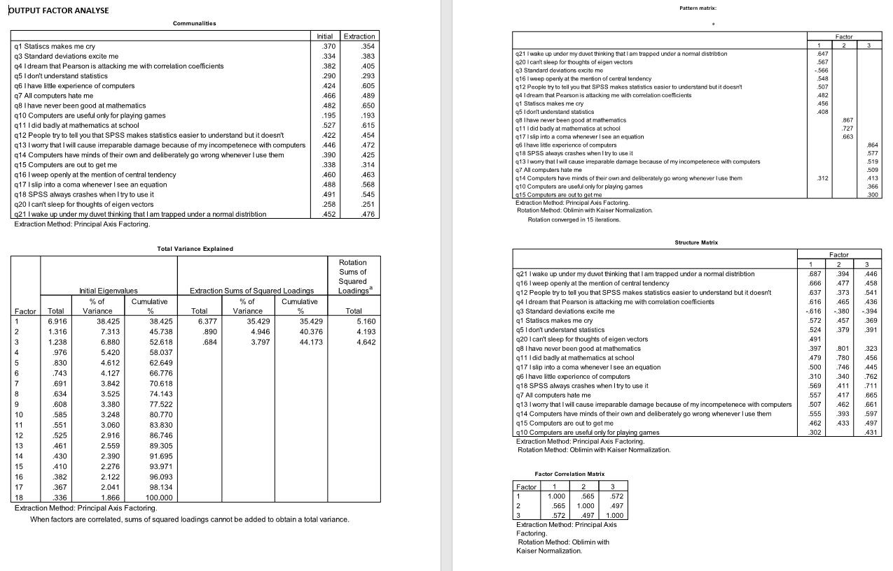

```{r, echo = FALSE, results = "hide"}
include_supplement("1658143402810.png", recursive = TRUE)
```

Question
========
The following question relates to the accompanying output of a factor analysis on items aimed at measuring anxiety about SPSS among students. measure.  
  
What can be concluded based on the analyses?  
1: As students have less fear of statistics they also have less fear of computers 2: students' fear of statistics is unrelated to their fear of mathematics  
  


Answerlist
----------
* Neither statement is correct
* Both statements are correct
* Statement 1 is correct; Statement 2 is not correct
* Statement 2 is correct; statement 1 is not correct

Solution
========

Answerlist
----------
* False
* False
* True
* False

Meta-information
================
exname: vufsw-factor analysis-2109-en
extype: schoice
exsolution: 0010
exshuffle: TRUE
exsection: factoranalysis
exextra[ID]: e1d63
exextra[Type]: output
exextra[Program]: NA
exextra[Language]: English
exextra[Level]: statistical reasoning

