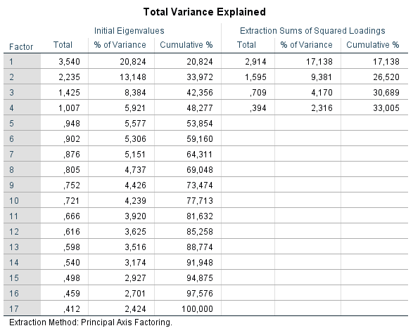
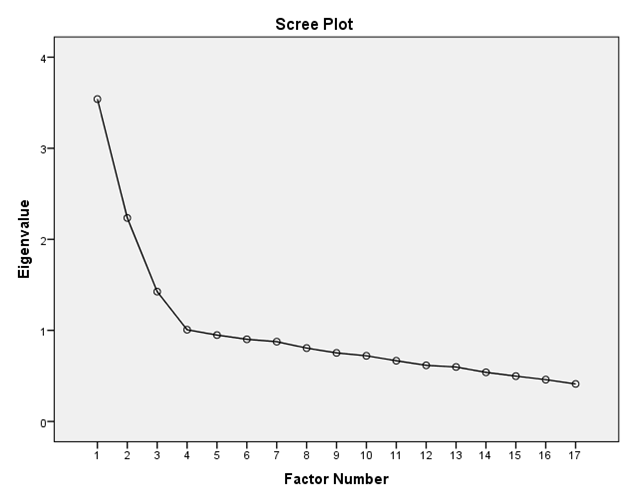

```{r, echo = FALSE, results = "hide"}
include_supplement("1605700807274.png", recursive = TRUE)
include_supplement("1605700826628.png", recursive = TRUE)
```

Question
========
  
  
See the output above. How many factors should be extracted according to the Kaiser's criterion be extracted, and how many based on the scree plot?

Answerlist
----------
* 2 according to the Kaiser's criterion; 3 based on the scree plot
* 4 according to the Kaiser's criterion; 3 based on the scree plot
* 2 according to Kaiser's criterion; 4 based on the scree plot
* 4 according to Kaiser's criterion; 4 based on the scree plot

Solution
========

Answerlist
----------
* False
* True
* False
* False

Meta-information
================
exname: vufsw-scree plo-1299-en
extype: schoice
exsolution: 0100
exshuffle: TRUE
exsection: factor analysis/scree plot
exextra[ID]: f95a8
exextra[Type]: interpreting output
exextra[Program]: NA
exextra[Language]: English
exextra[Level]: statistical literacy

