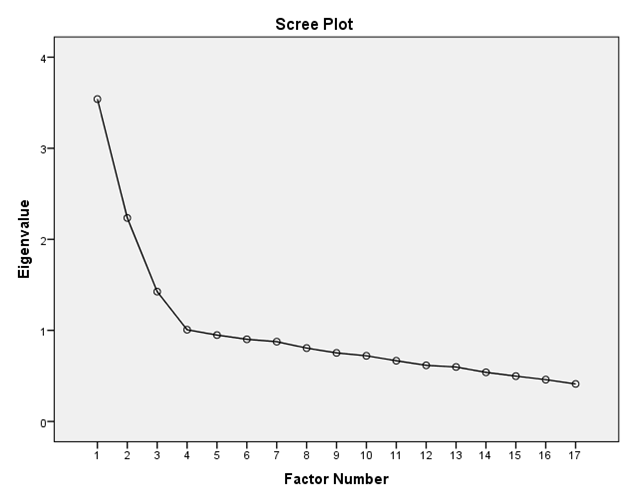

```{r, echo = FALSE, results = "hide"}
include_supplement("1605700807274.png")
include_supplement("1605700826628.png")
```

Question
========
    
  
Zie bovenstaande output. Hoeveel factoren moeten er volgens het Kaiser’s
criterium geëxtraheerd worden, en hoeveel op basis van het scree plot?

Answerlist
----------
* 2 volgens het Kaiser’s criterium; 3 op basis van het scree plot
* 4 volgens het Kaiser’s criterium; 3 op basis van het scree plot
* 2 volgens het Kaiser’s criterium; 4 op basis van het scree plot
* 4 volgens het Kaiser’s criterium; 4 op basis van het scree plot

Solution
========


Answerlist
----------
* False
* True
* False
* False

Meta-information
================
exname: vufsw-scree plo-1299-nl
extype: schoice
exsolution: 0100
exshuffle: TRUE
exsection: factor analysis/scree plot
exextra[Type]: interpreting output
exextra[Program]: NA
exextra[Language]: dutch
exextra[Level]: statistical literacy

