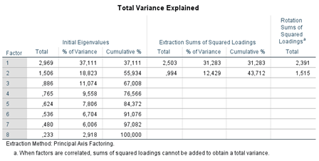
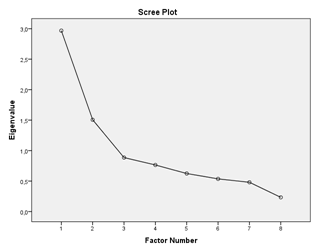

```{r, echo = FALSE, results = "hide"}
include_supplement("1602958672291.png", recursive = TRUE)
include_supplement("1602958713146.png", recursive = TRUE)
```

Question
========
 
  
Zie bovenstaande uitvoer. Hoeveel factoren moeten er volgens het Kaiser's criterium geëxtraheerd worden, en hoeveel op basis van de scree plot?

Answerlist
----------
* 2 volgens het Kaiser's criterium; 3 op basis van de scree plot
* 8 volgens het Kaiser's criterium; 2 op basis van het scree plot
* 2 volgens het Kaiser's criterium; 2 op basis van het scree plot
* 8 volgens het Kaiser's criterium; 3 op basis van het scree plot

Solution
========

Answerlist
----------
* Onwaar
* Onwaar
* Waar
* Onwaar

Meta-information
================
exname: vufsw-scree plot-1290-nl
extype: schoice
exsolution: 0010
exshuffle: TRUE
exsection: factor analysis/scree plot
exextra[ID]: 4b2f8
exextra[Type]: interpreting output
exextra[Program]: NA
exextra[Language]: Dutch
exextra[Level]: statistical literacy

