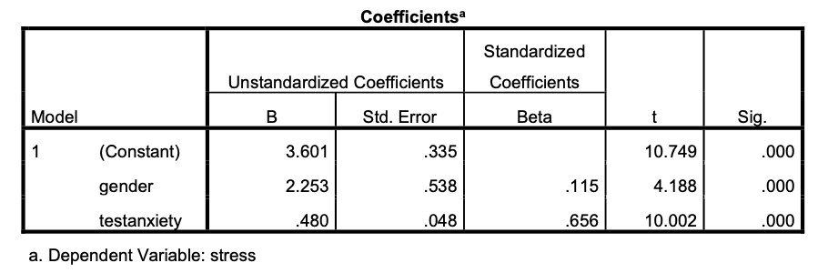

```{r, echo = FALSE, results = "hide"}
# add picture
include_supplement("eur-inferential-101-en-img101.png", recursive = TRUE)
```
Question
========
Een onderzoeker onderzoekt de criteriumvaliditeit van een instrument dat testangst meet en dat wordt gebruikt om de mate van ervaren stress tijdens een examen te voorspellen. De tabel hieronder toont de SPSS uitvoer van de regressieanalyse die de onderzoeker uitvoerde (n=52, 49% vrouw), waarbij ze stress tijdens een examen voorspelde op basis van de voorspellers geslacht en testangst. Merk op dat bij de variabele geslacht mannen de codering 0 kregen en vrouwen de codering 1.



Schrijf de regressievergelijking op voor mannen en vrouwen afzonderlijk.


Solution
========
De algemene formulering van de regressielijn is: stress = $b_0 + b_1 \times gender + b_2 \times testanxiety$

Voor mannen wordt de vergelijking: stress = $3.601 + 2.253 \times 0 + .480 \times testanxiety = 3.601 + .480 \times testanxiety$

Voor vrouwen wordt de vergelijking: stress = $3.601 + 2.253 \times 1 + .480 \times testanxiety = 5.854 + .480 \times testanxiety$

Meta-information
================
exname: eur-inferential_statistics-101-nl
extype: string
exsolution: ""
extol: 
exsection: Inferential Statistics/Regression/Equation, Inferential Statistics/Regression/Dummies
exextra[ID]: 82589
exextra[Type]: Conceptual
exextra[Program]: 
exextra[Language]: Dutch
exextra[Level]: Statistical Literacy
