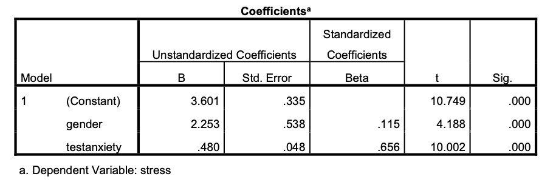

```{r, echo = FALSE, results = "hide"}
#Load package
library(exams)
library(knitr)

# add picture
include_supplement("eur-inferential-102-en-img102.png", recursive = TRUE)
```
Question
========
Een onderzoeker wil de criteriumvaliditeit onderzoeken van een testangsttest die gebruikt wordt om het niveau van ervaren stress tijdens een examen te voorspellen. Hij vraagt zich af of er sprake is van een interceptbias door het differentiële effect van geslacht op de relatie. De tabel hieronder toont de SPSS-uitvoer van de regressieanalyse die de onderzoeker uitvoerde (n=52, 49% vrouw). Merk op dat mannen de code 0 kregen en vrouwen de code 1.



Wat concludeer je op basis van de uitvoer over de interceptbias?


Solution
========
Wanneer de testangst 0 is, is de stressscore van mannen 3,601 en die van vrouwen 5,854. Het verschil tussen mannen en vrouwen bij angst=0 is significant (p<,001). Het verschil bij angst=0 tussen mannen en vrouwen is significant (p<.001), dus de intercept bias is waarschijnlijk aanwezig. Vrouwen zullen bij elke angstscore een hogere stressscore hebben dan mannen met dezelfde angstscore. De voorspeller angstniveau "werkt" dus niet op dezelfde manier voor de twee geslachten.

Meta-information
================
exname: eur-inferential_statistics-102-nl
extype: string
exsolution: ""
extol: 
exsection: Inferential Statistics/Regression/Equation, Inferential Statistics/Regression/Intercept, Inferential Statistics/Regression/Slope, Inferential Statistics/Regression/Simple linear regression
exextra[ID]: ec229
exextra[Type]: Conceptual / Interpreting output
exextra[Program]: 
exextra[Language]: Dutch
exextra[Level]: Statistical Literacy


Inferential Statistics/Regression/Dummies
