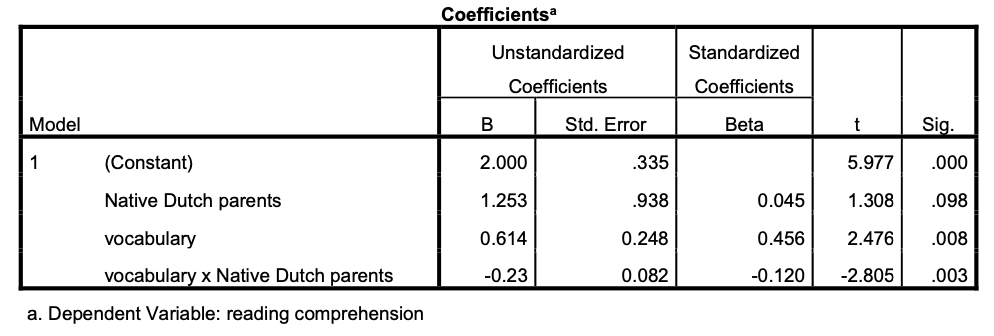

Question
========
Een onderzoeker onderzoekt de criteriumvaliditeit van een woordenschattoets die in groep 1 wordt afgenomen om begrijpend lezen in groep 4 te voorspellen. Uit eerder onderzoek weet ze dat er een zekere testbias kan zijn met betrekking tot de moedertaal van de ouders. Kinderen van wie de ouders geen Nederlands als moedertaal hebben, zullen naar verwachting een andere relatie vertonen tussen woordenschat en begrijpend lezen dan kinderen van wie de ouders Nederlands als moedertaal hebben. De resultaten van de regressieanalyses (n=74, 12% anderstalige ouders) staan hieronder. Merk op dat de dummyvariabele "Native Dutch Parents" 1 is als de ouders Nederlands als moedertaal hebben en 0 anders.

Leg uit waarom de testvertekening in dit geval betrekking heeft op hellingvertekening en niet per se op interceptvertekening.

Solution
========
De onderzoeker verwacht dat de relatie tussen woordenschattoets en begrijpend lezen kan verschillen voor de twee groepen. Dit heeft betrekking op de helling van de functie en niet op het intercept, omdat de helling een goede indicator is voor de relatie tussen twee kwantitatieve variabelen. De helling geeft immers informatie over het volgende: hoeveel verandert (voorspelde) y (in dit geval begrijpend lezen in klas 4) als x (woordenschatniveau in klas 1) met 1 punt verandert? Merk ook op dat het hoofdeffect van Nederlandse ouders niet significant is.

Meta-information
================
exname: eur-inferential_statistics-103-nl
extype: string
exsolution: ""
extol: 
exsection: Inferential Statistics/Regression/Equation, Inferential Statistics/Regression/Intercept, Inferential Statistics/Regression/Slope, Inferential Statistics/Regression/Simple linear regression
exextra[ID]: 7f648
exextra[Type]: Conceptual
exextra[Program]: 
exextra[Language]: Dutch
exextra[Level]: Statistical Literacy
