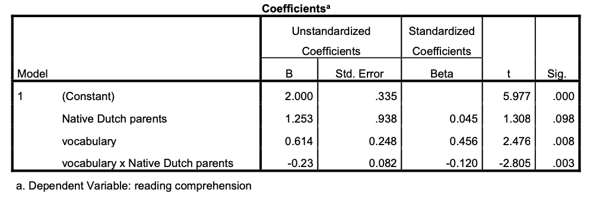

```{r, echo = FALSE, results = "hide"}
# add picture
include_supplement("eur-inferential-104-en-img104.png", recursive = TRUE)
```
Question
========
Een onderzoeker onderzoekt de criteriumvaliditeit van een woordenschattoets die in groep 1 wordt afgenomen om begrijpend lezen in groep 4 te voorspellen. Uit eerder onderzoek weet ze dat er een zekere testbias kan zijn met betrekking tot de moedertaal van de ouders. Kinderen van wie de ouders geen Nederlands als moedertaal hebben, zullen naar verwachting een andere relatie vertonen tussen woordenschat en begrijpend lezen dan kinderen van wie de ouders Nederlands als moedertaal hebben. De resultaten van de regressieanalyses (n=74, 12% anderstalige ouders) staan hieronder. Merk op dat de dummyvariabele "Native Dutch Parents" 1 is als de ouders Nederlands als moedertaal hebben en 0 anders.



Schrijf de regressievergelijking op voor autochtone en allochtone ouders.


Solution
========
De algemene formulering van de regressielijn is: begrijpend lezen = $b_0 + b_1 ND parents + b_2 vocabulary + b_3 ND parents \times vocabulary$

Voor anderstalige ouders wordt de vergelijking: begrijpend lezen = $2 + 1.253 \times 0 + 0.614 \times vocabulary -0.23 \times 0 \times vocabulary$
begrijpend lezen = $2 + 0.614 vocabulary$

For Native parents the equation becomes:
begrijpend lezen = $2 + 1.253 \times 1 + 0.614 \times vocabulary -0.23 \times 1 \times vocabulary$
begrijpend lezen = $3.253 + 0.384 vocabulary$

Meta-information
================
exname: eur-inferential_statistics-104-nl
extype: string
exsolution: ""
extol: 
exsection: Inferential Statistics/Regression/Equation, Inferential Statistics/Regression/Dummies
exextra[Type]: Conceptual
exextra[Program]: 
exextra[Language]: Dutch
exextra[Level]: Statistical Literacy
