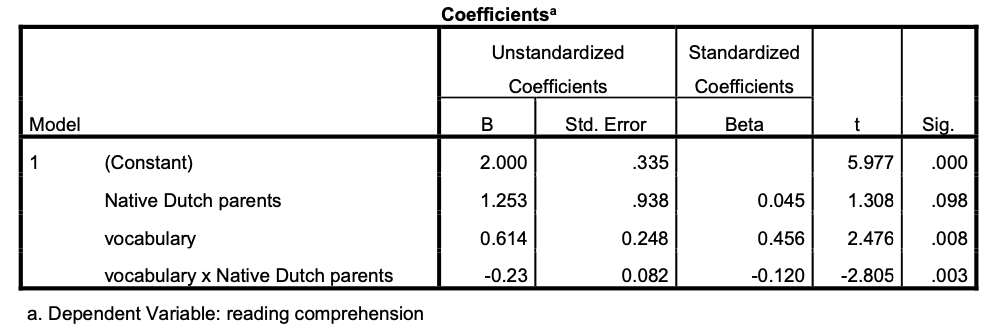

```{r, echo = FALSE, results = "hide"}
include_supplement("eur-inferential-105-en-img105.png", recursive = TRUE)
```
Question
========
A researcher investigates the criterion validity of a vocabulary test administered in grade 1 in order to predict reading comprehension in grade 4. From previous research she knows that there may be some test bias with respect to the native language of parents. Children whose parents are not Dutch native speakers are expected to show a different relationship between vocabulary and reading comprehension than children whose parents are native Dutch speaker. The results of the regression analyses (n=74, 12% non‐native parents) are given below. Note that the dummy variable “Native Dutch Parents” is 1 when the parents are Dutch native and 0 otherwise.



Based on the output, what do you conclude about the slope bias and the criterion validity of the vocabulary test?


Solution
========
Non‐native speakers have a lower comprehension score than native speakers when vocabulary is 0, although this difference is not significant (p=.098). The relationship between vocabulary and reading comprehension is different for the non‐native speakers and for the native speakers (p=.003). So, there is indeed a slope bias.


Meta-information
================
exname: eur-inferential_statistics-105-en
extype: string
exsolution: ""
extol: 
exsection: Inferential Statistics/Regression/Equation, Inferential Statistics/Regression/Intercept, Inferential Statistics/Regression/Slope, Inferential Statistics/Regression/Simple linear regression
exextra[ID]: 149c8
exextra[Type]: Interpreting output
exextra[Program]: 
exextra[Language]: English
exextra[Level]: Statistical Literacy
