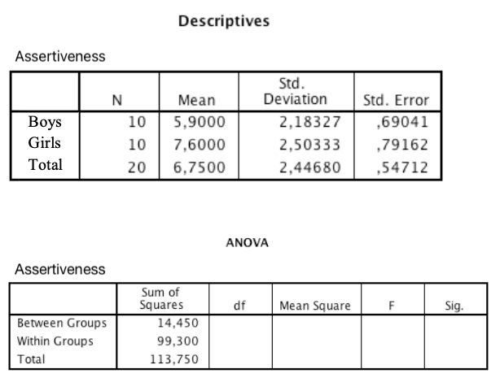

```{r, echo = FALSE, results = "hide"}
include_supplement("eur-inferential-106-en-img106.png", recursive = TRUE)
```

Question
========
In a study boys and girls are compared with respect to their assertiveness scores. This results in the following output.


What is the F-value for this ANOVA?

Answerlist
----------
* 2.62
* 3.73
* 1.92
* 2.31


Solution
========
The correct answer is 2.62

Answerlist
----------
* This is the correct answer!
* This answer is incorrect
* This answer is incorrect
* This answer is incorrect


Meta-information
================
exname: eur-inferential_statistics-106-en
extype: schoice
exsolution: 1000
exsection: Inferential Statistics/Parametric Techniques/ANOVA/ANOVA F-test, Inferential Statistics/Parametric Techniques/ANOVA/Oneway ANOVA
exextra[Type]: Interpreting output
exextra[Program]: 
exextra[Language]: English
exextra[Level]: Statistical Literacy
exshuffle: FALSE