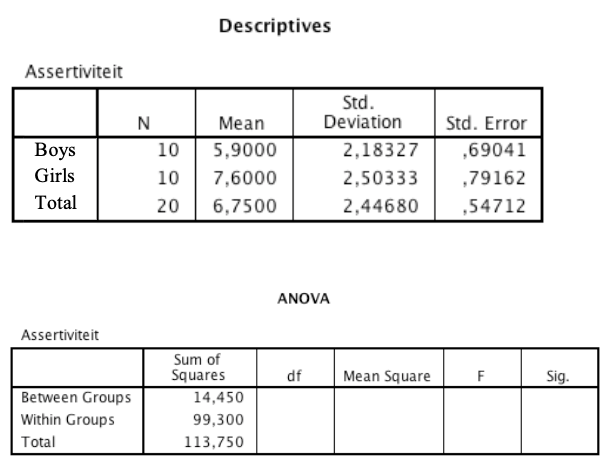

```{r, echo = FALSE, results = "hide"}
include_supplement("eur-inferential-106-en-img106.png", recursive = TRUE)
```

Question
========
In een onderzoek worden jongens en meisjes vergeleken op hun scores voor assertiviteit. Dit resulteert in de volgende output.


Wat is de F-waarde voor deze ANOVA?

Antwoordlijst
----------
* 2.62
* 3.73
* 1.92
* 2.31


Solution
========
Het juiste antwoord is 2,62

Antwoordenlijst
----------
* Dit is het goede antwoord!
* Dit antwoord is onjuist
* Dit antwoord is onjuist
* Dit antwoord is onjuist

Meta-information
================
exname: eur-inferential_statistics-106-nl
extype: schoice
exsolution: 1000
exsection: Inferential Statistics/Parametric Techniques/ANOVA/ANOVA F-test, Inferential Statistics/Parametric Techniques/ANOVA/Oneway ANOVA
exextra[Type]: Interpreting output
exextra[Program]: 
exextra[Language]: Dutch
exextra[Level]: Statistical Literacy
exshuffle: FALSE
