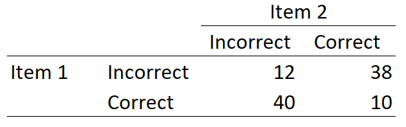

Question
========
Calculate the inter-item correlation between item 1 and item 2:

Answerlist
----------
* -.56
* .12
* -.14
* .23

Solution
========
So from this table we can calculate the proportion of people who gave correct answers to both questions, this is: $10 \div 100=.1$. 
The covariance is then: $Sxy = Pxy - Px \times Py = =0.1 - 0.48 \times 0.50= -0.14$.
The product of the standard deviations of the questions is: $√Px \times (1-Px) \times Py \times (1 - Py) = √0.48 \times 0.52 \times 0.50 \times 0.50 = 0.25$.
Thus, the correlation (phi coefficient) becomes: $-0.14 \div 0.25 = -0.56$

Answerlist
----------
* True
* False
* False
* False

Meta-information
================
exname: eur-inferential_statistics-201-en
extype: schoice
exsolution: 1000
exsection: Inferential Statistics/Parametric Techniques/Correlations/Phi
exextra[Type]: Calculate
exextra[Program]: Calculator
exextra[Language]: English
exextra[Level]: Statistical Literacy
exshuffle: TRUE