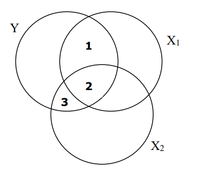

Question
========
In SPSS wordt een hiërarchische regressieanalyse uitgevoerd om Y te voorspellen uit X1 (blok 1) en X2 (blok 2). Het onderstaande Venn-diagram geeft voor deze analyse aan wat de bijdrage is van elke voorspeller aan de verklaarde variantie in Y.

Welk deel in het Venn-diagram geeft de R2-verandering voor X2 (blok 2) aan?

Answerlist
----------
* 1 + 2 + 3
* 2 + 3
* 2
* 3

Solution
========
Het juiste antwoord is 3. De verandering in R-kwadraat heeft te maken met de extra variantie die je zou kunnen verklaren als je X2 zou meenemen (bovenop X1). In het Venn-diagram kan dit worden gezien als de unieke variantie in Y die wordt verklaard door X2 (of stuk 3).

(1+2+3) is onjuist, omdat dit stuk de R-kwadraat (verklaarde variantie) van het hele model weergeeft (dat wil zeggen, wanneer je zowel X1 als X2 meerekent om Y te voorspellen). (2+3) is onjuist, dit stuk zou de R-kwadraat (verklaarde variantie) zijn als je alleen X2 meerekent om Y te voorspellen. (2) is onjuist. Dit is de variantie in Y die gedeeld wordt door zowel X1 als X2 (zonder de unieke bijdragen van X1 en X2).

Answerlist
----------
* Onjuist
* Onwaar
* Onwaar
* Waar

Meta-information
================
exname: eur-inferential_statistics-214-nl
extype: schoice
exsolution: 0001
exsection: Inferential Statistics/Regression/Multiple linear regression/R squared change, Inferential Statistics/Regression/R squared
exextra[ID]: 1a2ee
exextra[Type]: Interpreting graph
exextra[Program]: 
exextra[Language]: Dutch
exextra[Level]: Statistical Literacy
