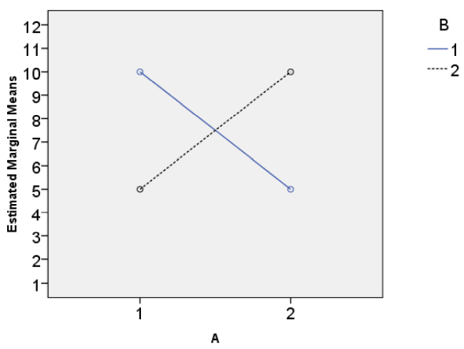

Question
========
De onderstaande figuur is een interactiegrafiek die het resultaat is van een factorial ANOVA met twee tussen-subject factoren, A en B, elk met twee condities en N = 40.

Welk van de drie effecten in de factorial ANOVA zou zeker NIET significant zijn?

Answerlist
----------
* Het hoofdeffect van A, we zijn niet zeker van het hoofdeffect van B
* Het hoofdeffect van A én het hoofdeffect van B
* Het interactie-effect A*B
* B en c zijn beide juist

Solution
========
Het hoofdeffect van een onafhankelijke variabele verwijst naar het totale effect van deze variabele op de afhankelijke variabele, ongeacht het niveau van de andere onafhankelijke variabele. Uit de grafiek kun je zien dat er geen verschil is in gemiddelden tussen A1 en A2. Dit gemiddelde lijkt hetzelfde te zijn voor beide condities (je kunt dit voor elke conditie van A zien door het midden te nemen tussen de lijnen B1 en B2; het punt dat je vindt voor A1 ligt op dezelfde hoogte als het punt voor A2). Er is dus geen hoofdeffect van A, want in dit geval zou je een verschil verwachten tussen de gemiddelden van A1 en A2. Hetzelfde geldt ook voor B1 en B2. Er is dus ook geen hoofdeffect van B.

Je zou echter wel een interactie verwachten, aangezien de lijnen elkaar zo netjes kruisen.

Answerlist
----------
* Onjuist
* Waar
* Onwaar
* Onwaar

Meta-information
================
exname: eur-inferential_statistics-217-nl
extype: schoice
exsolution: 0100
exsection: Inferential Statistics/Parametric Techniques/ANOVA/Twoway ANOVA, Inferential Statistics/NHST/p-value
exextra[Type]: Interpreting graph
exextra[Program]: 
exextra[Language]: Dutch
exextra[Level]: Statistical Literacy
