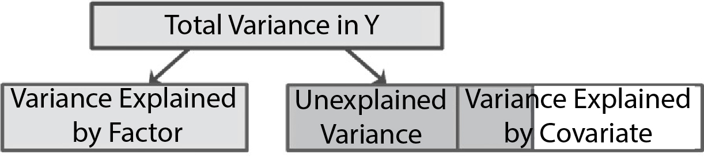

```{r, echo = FALSE, results = "hide"}
include_supplement("uu-ANCOVA-872-en-graph01.jpg", recursive = TRUE)
```
Question
========
What is a reason to include a covariate in your ANOVA?

Answerlist
----------
* To increase the within-group error variance.
* Because you are interested in the interaction between the covariate and the dependent variable.
* Because you are interested in the interaction between the covariate and the independent variable.
* To decrease the within-group error variance.


Solution
========
One reason for including a covariate in an ANOVA is that within-group error variance gets smaller.



Meta-information
================
exname: uu-ANCOVA-872-en
extype: schoice
exsolution: 0001
exsection: Inferential Statistics/Parametric Techniques/ANOVA/ANCOVA
exextra[ID]: 2918c
exextra[Type]: Conceptual
exextra[Program]: 
exextra[Language]: English
exextra[Level]: Statistical Reasoning