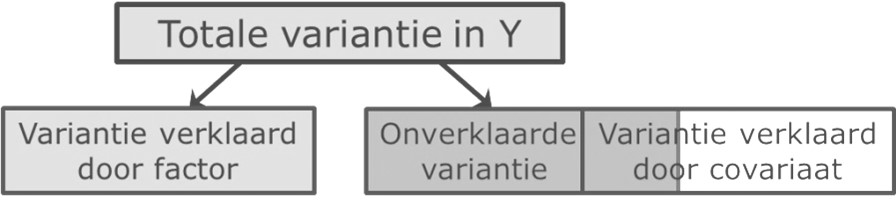

```{r, echo = FALSE, results = "hide"}
include_supplement("uu-ANCOVA-872-nl-graph01.jpg", recursive = TRUE)
```
Question
========
Wat is een reden om een covariaat in je ANOVA  op te nemen?

Answerlist
----------
* Om de binnen-groep error variantie te vergroten.
* Omdat je geïnteresseerd bent in de interactie tussen de covariaat en de afhankelijke variabele.
* Omdat je geïnteresseerd bent in de interactie tussen de covariaat en de onafhankelijke variabele.
* Om de binnen-groep error variantie te verkleinen.


Solution
========
Een reden om een covariaat op te nemen in een ANOVA is dat binnen-groep error variantie kleiner wordt.




Meta-information
================
exname: uu-ANCOVA-872-nl
extype: schoice
exsolution: 0001
exsection: Inferential Statistics/Parametric Techniques/ANOVA/ANCOVA
exextra[ID]: 9666e
exextra[Type]: Conceptual
exextra[Program]: 
exextra[Language]: Dutch
exextra[Level]: Statistical Reasoning