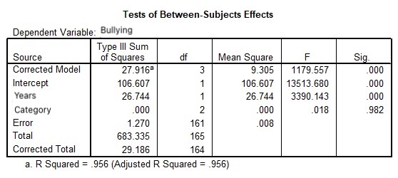

```{r, echo = FALSE, results = "hide"}
include_supplement("uu-ANCOVA-881-en-graph01.jpg", recursive = TRUE)
```
Question
========
TRUE should we look at in the output to determine whether the number of years students have already been in school meets the condition to be a control variable in this analysis?



Answerlist
----------
* The significance of the whole model in the first row of the output (Corrected Model)
* The significance of the factor
* The value of $R^2$ (R squared)
* The significance of the variable years


Solution
========

Meta-information
================
exname: uu-ANCOVA-881-en
extype: schoice
exsolution: 0001
exsection: Inferential Statistics/Parametric Techniques/ANOVA/ANCOVA
exextra[ID]: fcb7d
exextra[Type]: Interpretating output
exextra[Program]: SPSS
exextra[Language]: English
exextra[Level]: Statistical Reasoning