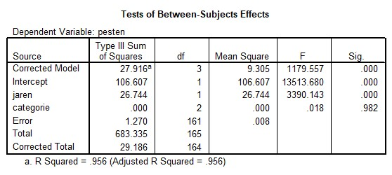

```{r, echo = FALSE, results = "hide"}
include_supplement("uu-ANCOVA-882-nl-graph01.jpg", recursive = TRUE)
```
Question
========
Er wordt onderzoek gedaan van het effect van onderwijscategorie en aantal jaren op pestgedrag.
We zien dat er na correctie geen significante verschillen zijn tussen de drie onderwijscategorieën. Welk eigenschap naast de p-waarde in bovenstaande tabel geeft aan dat we te maken hebben met een niet significant resultaat?



Answerlist
----------
* $MS_{categorie}$ < 0.001
* MSR ≈ 0
* $R^2$ > 90%
* Fcategorie < 1


Solution
========


Meta-information
================
exname: uu-ANCOVA-882-nl
extype: schoice
exsolution: 0001
exsection: Inferential Statistics/Parametric Techniques/ANOVA/ANCOVA
exextra[Type]: Interpretating output
exextra[Program]: SPSS
exextra[Language]: Dutch
exextra[Level]: Statistical Reasoning