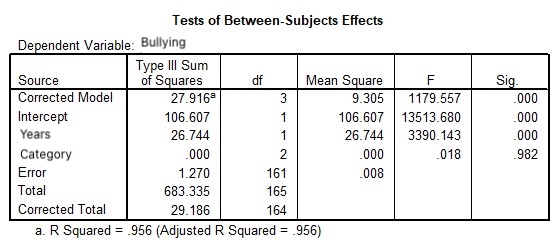

```{r, echo = FALSE, results = "hide"}
include_supplement("uu-ANCOVA-884-en-graph01.jpg", recursive = TRUE)
```
Question
========
Using the one-way ANOVA, we saw significant differences in average bullying behavior between the three groups. After adjusting for the variable years, the differences were suddenly no longer significant. What happened? 



Answerlist
----------
* The covariate has already explained most of the dispersion. This led to a smaller between-group spread, making the differences between the groups relatively larger.
* The inclusion of the covariate led to a larger between-group spread, resulting in a smaller F-ratio.
* Including the covariate led to a smaller within-group spread. The corrected averages are further apart this way.
* The covariate already explained most of the spread. This leads to a smaller intermediate dispersion, making the differences between the groups relatively smaller.


Solution
========

Meta-information
================
exname: uu-ANCOVA-884-en
extype: schoice
exsolution: 0001
exsection: Inferential Statistics/Parametric Techniques/ANOVA/ANCOVA
exextra[Type]: Interpretating output
exextra[Program]: SPSS
exextra[Language]: English
exextra[Level]: Statistical Reasoning