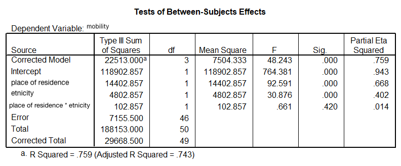

```{r, echo = FALSE, results = "hide"}
include_supplement("uu-ANCOVA-885-en-tabel.png", recursive = TRUE)
```


Question
========
  
The output below shows the results of Van den Berg's research.





Here are four statements about this research, which one is correct? 
Answerlist
----------
* In this research you have 4 independent variables, namely immigrant women, native women, urban and rural.
* This research has 1 dependent variable, which is social mobility.
* In this study, the independent variables are manipulated and the dependent variable(s) are not.
* In this study, the independent variables are not manipulated and the dependent variable(s) are.

Solution
========
* This answer is incorrect.
* This answer is correct.
* This answer is incorrect.
* This answer is incorrect.

Meta-information
================
exname: uu-ANCOVA-885-en
extype: schoice
exsolution: 0100
exsection: Inferential Statistics/Parametric Techniques/ANOVA/ANCOVA
exextra[Type]: Conceptual, Interpretating output
exextra[Program]: SPSS
exextra[Language]: English
exextra[Level]: Statistical Literacy