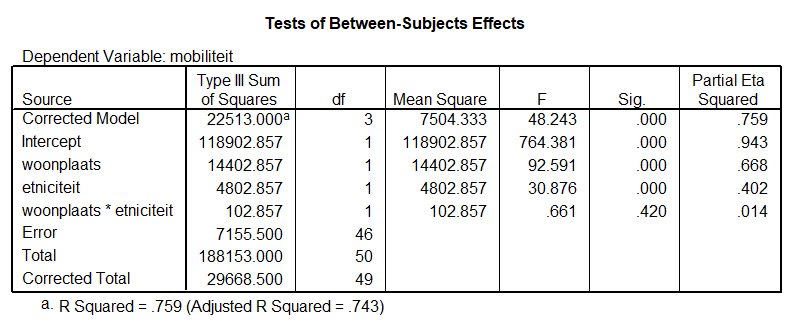

```{r, echo = FALSE, results = "hide"}
include_supplement("uu-ANCOVA-885-nl-tabel.png", recursive = TRUE)
```


Question
========
  
In onderstaande output is af te lezen wat de resultaten zijn van het onderzoek van Van den Berg.





Hier volgen vier beweringen over dit onderzoek, welke is juist?
  
Answerlist
----------
* In dit onderzoek heb je vier onafhankelijke variabelen, namelijk allochtone vrouwen, autochtone vrouwen, stad en platteland. 
* Dit onderzoek kent 1 afhankelijke variabele, namelijk sociale mobiliteit.
* In dit onderzoek worden de onafhankelijke variabelen gemanipuleerd en de afhankelijke variabele(n) niet.
* In dit onderzoek worden de onafhankelijke variabelen niet gemanipuleerd en de 
afhankelijke variabele(n) wel.

Solution
========
* Dit antwoord is incorrect.
* Dit antwoord is correct.
* Dit antwoord is incorrect.
* Dit antwoord is incorrect.

Meta-information
================
exname: uu-ANCOVA-885-nl.Rmd
extype: schoice
exsolution: 0100
exsection: Inferential Statistics/Parametric Techniques/ANOVA/ANCOVA
exextra[Type]: Conceptual, Interpretating output
exextra[Program]: SPSS
exextra[Language]: Dutch
exextra[Level]: Statistical Literacy