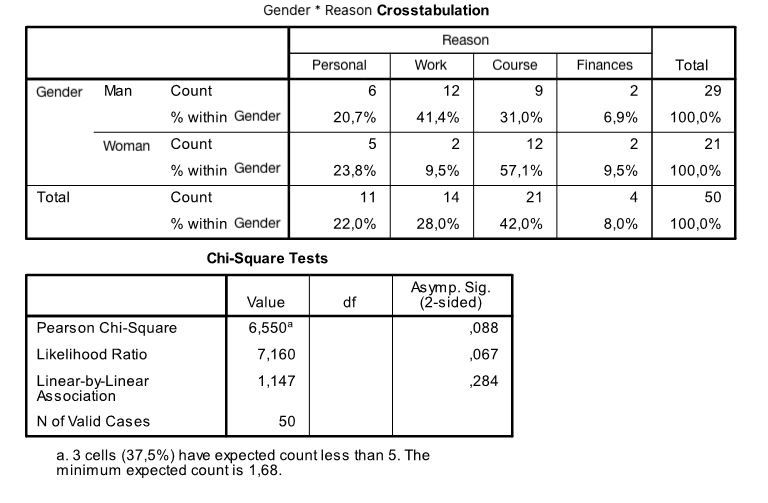

```{r, echo = FALSE, results = "hide"}
include_supplement("uu-ANOVA-819-en-tabel.jpeg", recursive = TRUE)
```


Question
========
  
Why do students quit a course? A researcher at the Faculty of Social Sciences surveyed 52 students at Utrecht University who quit a course in the past year. They could choose from four different reasons: Personal, Course-related, Work or Financial. Does the reason for quitting depend on the student's gender?

SPSS output is below.



Students are also asked to indicate how difficult they found it to quit the course. This is measured with a scale score between 1 and 10. Which of the following tests could we use to see if there are differences between men and women? 

Answerlist
----------
* $\chi$2 Goodness-of-fit test.
* ANOVA
* Two-way ANOVA
* Spearman correlation test

Solution
========


Answerlist
----------
* This answer is incorrect.
* This answer is correct.
* This answer is incorrect.
* This answer is incorrect.

Meta-information
================
exname: uu-ANOVA-819-en
extype: schoice
exsolution: 0100
exsection: Inferential Statistics/Parametric Techniques/ANOVA
exextra[Type]: Conceptual, Interpretating output
exextra[Program]: SPSS
exextra[Language]: English
exextra[Level]: Statistical Literacy