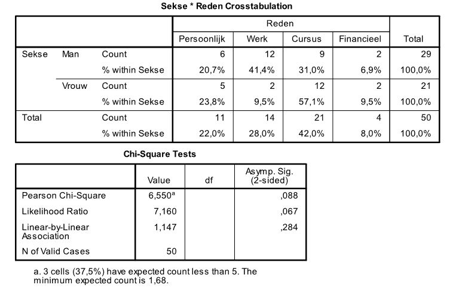

```{r, echo = FALSE, results = "hide"}
include_supplement("uu-ANOVA-819-nl.tabel.JPG", recursive = TRUE)
```


Question
========
  
Waarom stoppen studenten met een cursus? Een onderzoeker aan de Faculteit Sociale Wetenschappen ondervraagt 52 studenten van de Universiteit Utrecht die in het afgelopen jaar gestopt zijn met een cursus. Er kon gekozen worden uit vier verschillende redenen: Persoonlijk, Cursusgerelateerd, Werk of Financieel. Hangt de reden om te stoppen af van het geslacht van de student? 

SPSS-output staat hieronder.



De studenten wordt ook gevraagd om aan te geven hoe moeilijk ze het vonden om met de cursus te stoppen. Dit wordt gemeten met een schaalscore tussen de 1 en de 10. Met welk van de onderstaande toetsen zouden we kunnen bekijken of er verschillen zijn tussen mannen en vrouwen?
  
Answerlist
----------
* $\chi$2 Goodness-of-fit-test
* ANOVA
* tweeweg-ANOVA 
* Spearman-correlatietoets

Solution
========


Answerlist
----------
* Dit antwoord is incorrect.
* Dit antwoord is correct.
* Dit antwoord is incorrect.
* Dit antwoord is incorrect.

Meta-information
================
exname: uu-ANOVA-819-nl.Rmd
extype: schoice
exsolution: 0100
exsection: Inferential Statistics/Parametric Techniques/ANOVA
exextra[Type]: Conceptual, Interpretating output
exextra[Program]: SPSS
exextra[Language]: Dutch
exextra[Level]: Statistical Literacy