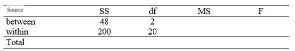

```{r, echo = FALSE, results = "hide"}
include_supplement("uu-ANOVA-822-en-tabel.jpg", recursive = TRUE)
```

Question
========
  
From a study, the result is presented in the ANOVA table below



This shows that: 
Answerlist
----------
* The result found is not significant at 5% because Fobt < Fcrit.
* The result found is not significant at 5% because Fobt > Fcrit.
* The result found is significant at 5% because Fobt > Fcrit.
* The result found is significant at 5% because Fobt < Fcrit.


Solution
========

Meta-information
================
exname: uu-ANOVA-822-en
extype: schoice
exsolution: 1000
exsection: Inferential Statistics/Parametric Techniques/ANOVA
exextra[ID]: db1f5
exextra[Type]: Interpretating graph
exextra[Program]: SPSS
exextra[Language]: English
exextra[Level]: Statistical Literacy
