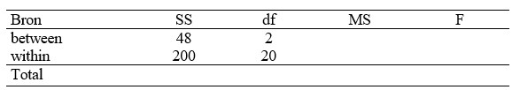

```{r, echo = FALSE, results = "hide"}
include_supplement("uu-ANOVA-822-nl-tabel.jpg", recursive = TRUE)
```


Question
========
  
Uit een onderzoek is het resultaat in onderstaande ANOVA-tabel gepresenteerd



Hieruit blijkt dat:
  
Answerlist
----------
* Het gevonden resultaat is niet significant op 5% want Fobt < Fcrit.
* Het gevonden resultaat is niet significant op 5% want Fobt > Fcrit 
* Het gevonden resultaat is significant op 5% want Fobt > Fcrit.
* Het gevonden resultaat is significant op 5% want Fobt < Fcrit.


Solution
========
  


Meta-information
================
exname: uu-ANOVA-822-nl.Rmd
extype: schoice
exsolution: 1000
exsection: Inferential Statistics/Parametric Techniques/ANOVA
exextra[Type]: Interpretating graph
exextra[Program]: SPSS
exextra[Language]: Dutch
exextra[Level]: Statistical Literacy
