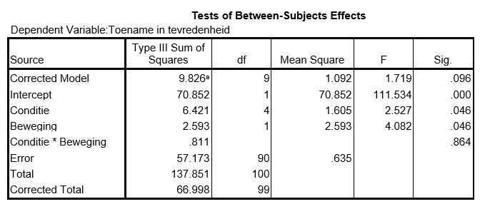

```{r, echo = FALSE, results = "hide"}
include_supplement("uu-ANOVA-825-nl-tabel.JPG", recursive = TRUE)
```


Question
========
  
Wade et al. (2009) conducted a study focusing on reducing body image dissatisfaction in women. One hundred first-year college students at Flinders University signed up to participate and were then randomly assigned to five different conditions: condition focused on Rumination (1), Cognitive Dissonance (2), Distraction (3), Acceptance (4), and a control group (5). One of the dependent variables is the increase in satisfaction with one's own weight.


Suppose researcher B is interested in exercise. One half of the women in each condition had some type of exercise added to their daily routine. The other half did nothing different than normal. The increase in satisfaction scores is compared not only between the five different conditions, but also between the two exercise groups. SPSS output from the analysis is below.



What is the value of the test quantity that tests the interaction between Condition and Motion?

  
Answerlist
----------
* 0.319
* 0.811
* 1.277
* 0.014

Solution
========

Answerlist
----------
* This answer is correct.
* This answer is incorrect.
* This answer is incorrect.
* This answer is incorrect.

Meta-information
================
exname: uu-ANOVA-825-en
extype: schoice
exsolution: 1000
exsection: Inferential Statistics/Parametric Techniques/ANOVA
exextra[Type]: Interpretating output, Case
exextra[Program]: SPSS
exextra[Language]: English
exextra[Level]: Statistical Literacy