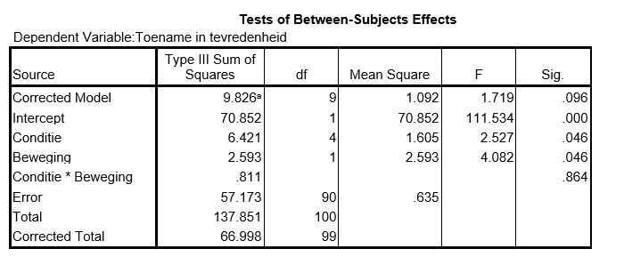

```{r, echo = FALSE, results = "hide"}
include_supplement("uu-ANOVA-825-nl-tabel.JPG", recursive = TRUE)
```


Question
========
  
Wade et al. (2009) hebben een onderzoek uitgevoerd waarbij het verminderen van de onvrede over het lichaamsbeeld bij vrouwen centraal staat. Honderd eerstejaars studentes van de Flinders University hebben zich aangemeld om mee te werken en werden vervolgens aselect in vijf verschillende condities ingedeeld: conditie gericht op Rumineren (1), Cognitieve Dissonantie (2), Afleiding (3), Acceptatie (4), en een controlegroep (5). Een van de afhankelijke variabelen is de toename van tevredenheid met het eigen gewicht. 


Stel dat onderzoeker B geïnteresseerd is in beweging. Er wordt bij de helft van de vrouwen in elke conditie een soort beweging toegevoegd aan hun dagelijkse routine. De andere helft deed niks anders dan normaal. De toename in tevredenheidscores wordt vergeleken niet alleen tussen de vijf verschillende condities, maar ook tussen de twee bewegingsgroepen. SPSS-output van de analyse staat hieronder.



Wat is de waarde van de toetsingsgrootheid die de interactie tussen Conditie en Beweging toetst?

  
Answerlist
----------
* 0.319
* 0.811
* 1.277
* 0.014

Solution
========

Answerlist
----------
* Dit antwoord is correct.
* Dit antwoord is incorrect.
* Dit antwoord is incorrect.
* Dit antwoord is incorrect.

Meta-information
================
exname: uu-ANOVA-825-nl.Rmd
extype: schoice
exsolution: 1000
exsection: Inferential Statistics/Parametric Techniques/ANOVA
exextra[Type]: Interpretating output, Case
exextra[Program]: SPSS
exextra[Language]: Dutch
exextra[Level]: Statistical Literacy