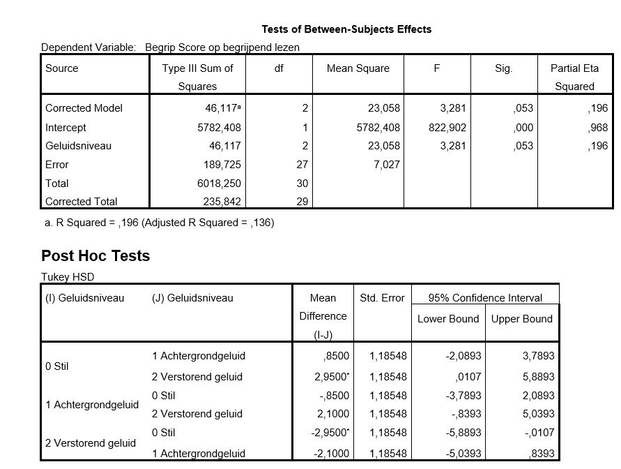

```{r, echo = FALSE, results = "hide"}
include_supplement("uu-ANOVA-827-nl-tabel.JPG", recursive = TRUE)
```

Question
========
  
During exam time, there is a lot of focus on how best to concentrate on studying the given material. Among other things, the question is asked whether you learn better in a very quiet environment, or rather in an environment with some background noise. In this study, students were divided into three groups of 10 students each. The first group had to take a test on reading comprehension in a quiet environment, the second in an environment with some background noise, and the third group had to take the test next to a room where renovations were taking place. Below is the result of the analysis of variance. 



What is the conclusion when tested at a 5% significance level?

Answerlist
----------
* The groups are not significantly different in their scores on reading comprehension.
* There are significant differences between the averages. The difference between the group in a quiet room and the group with disruptive noise is significant.
* There are significant differences between the averages. the differences between the groups in a quiet room and with background noise, and the groups with background noise and disruptive noise are significant.
* All three averages are significantly different from each other. 

Solution
========
  
The F-test of the ANOVA indicates that there is no significant effect of noise level at an alpha level of 5%. So therefore the groups are not significantly different from each other. Only when the F test for a factor is significant do you look at the Post-Hoc tests.


Answerlist
----------
* This answer is correct.
* This answer is incorrect.
* This answer is incorrect.
* This answer is incorrect.

Meta-information
================
exname: uu-ANOVA-827-en
extype: schoice
exsolution: 1000
exsection: Inferential Statistics/Parametric Techniques/ANOVA
exextra[Type]: Interpretating output
exextra[Program]: SPSS
exextra[Language]: English
exextra[Level]: Statistical Literacy