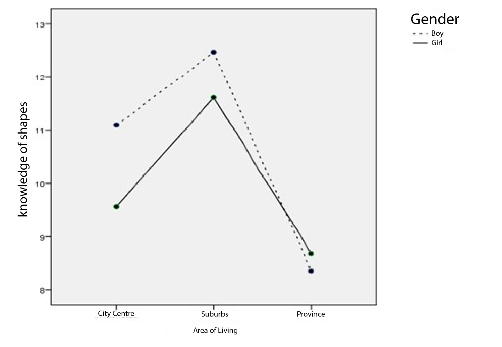

```{r, echo = FALSE, results = "hide"}
include_supplement("uu-ANOVA-833-en-graph01.jpg", recursive = TRUE)
```
Question
========
Using the data from the Sesame Street survey, a researcher conducted a multi-way ANOVA for KNOWLEDGE OF FORMS with the factors LOCATION (1 = inner city, 2 = suburb, 3 = county) and SEKSE (1 = boy, 2 = girl).

Using the mean chart shown, rate the following two statements. 



Assume that any differences you see are significant. I. There is a main effect of LIVING on SEKSE. II. There is an interaction between HOUSING and SEKSE ON KNOWLEDGE OF FORMS.

Answerlist
----------
* I is correct, II is correct.
* I is correct, II is not correct.
* I is not correct, II is not correct.
* I is not correct, II is correct.


Solution
========
Conclusion I is incorrect There is talk here of a main effect of one independent variable on the other independent variable. There is a main effect of living environment on knowledge of forms, the dependent variable. But there is no main effect of living environment on gender.

Conclusion II is correct The lines for boys and girls are not parallel. Boys and girls from a provincial residential environment have almost equal knowledge of shapes. However, for inner city and suburban areas, boys here have more knowledge of shapes than girls. Thus, there is an interaction between residential environment and gender on knowledge of shapes.

Meta-information
================
exname: uu-ANOVA-833-en
extype: schoice
exsolution: 0001
exsection: Inferential Statistics/Parametric Techniques/ANOVA
exextra[ID]: 5363d
exextra[Type]: Interpretating graph
exextra[Program]: SPSS
exextra[Language]: English
exextra[Level]: Statistical Reasoning