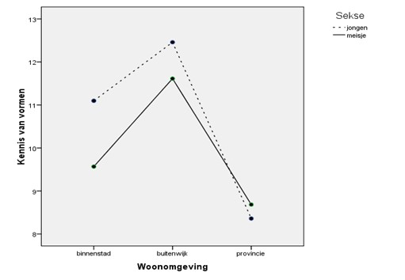

```{r, echo = FALSE, results = "hide"}
include_supplement("uu-ANOVA-833-nl-graph01.jpg", recursive = TRUE)
```
Question
========
Met de gegevens uit het Sesamstraat onderzoek heeft een onderzoeker  een meerweg ANOVA uitgevoerd voor KENNIS VAN VORMEN met de factoren  WOONOMGEVING (1 = binnenstad, 2 = buitenwijk, 3 = provincie) en SEKSE (1 = jongen, 2 = meisje). 

Beoordeel met het getoonde gemiddeldendiagram de volgende twee uitspraken. 



Ga er van uit dat alle verschillen die je ziet, significant zijn.
I. Er is een hoofdeffect van WOONOMGEVING op SEKSE.
II. Er is een interactie tussen WOONOMGEVING en SEKSE OP KENNIS VAN VORMEN.

Answerlist
----------
* I is juist, II is juist.
* I is juist, II is niet juist.
* I is niet juist, II is niet juist.
* I is niet juist, II is juist.


Solution
========
Conclusie I is onjuist
Er wordt hier gesproken over een hoofdeffect van de ene onafhankelijke variabele op de andere onafhankelijke variabele. Er is wel een hoofdeffect van woonomgeving op kennis van vormen, de afhankelijke variabele. Maar er is geen hoofdeffect van woonomgeving op sekse.

Conclusie II is juist
De lijnen voor jongens en meisjes lopen niet parallel. Jongens en meisjes uit een provinciale woonomgeving hebben vrijwel gelijke kennis van vormen. Voor de binnenstad en buitenwijk geldt echter dat jongens hier meer kennis hebben van vormen dan meisjes. Er is dus een interactie tussen woonomgeving en sekse op kennis van vormen.


Meta-information
================
exname: uu-ANOVA-833-nl
extype: schoice
exsolution: 0001
exsection: Inferential Statistics/Parametric Techniques/ANOVA
exextra[ID]: c6e33
exextra[Type]: Interpretating graph
exextra[Program]: SPSS
exextra[Language]: Dutch
exextra[Level]: Statistical Reasoning