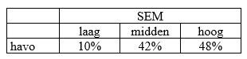
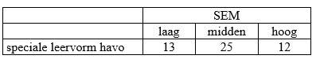

```{r, echo = FALSE, results = "hide"}
include_supplement("uu-Critical-value-802-nl-tabel.jpg", recursive = TRUE)
```

```{r, echo = FALSE, results = "hide"}
include_supplement("uu-Critical-value-802-nl-tabel2.jpg", recursive = TRUE)
```

Question
========
  
Of havo students, the distribution by Social Economic Environment (SEM) is known. This can be seen in the table below:



A dean wants to know if this ratio is the same among visitors to a special learning form of havo. To this end, he randomly draws a sample of fifty "special learning formers. The number of students per SEM category is shown in the table below. 



The dean wants to test the hypothesis that the origin of students from different backgrounds at the special learning high school is the same as that at the regular high school. Can the dean reject the stated hypothesis at α = .05? 
Answerlist
----------
* No, because $\chi^2 $ < $\chi^2 $ criticism
* No, because $\chi^2 $ > $\chi^2 $ criticism
* Yes, because $\chi^2 $ < $\chi^2 $ criticism
* Yes, because want $\chi^2 $ > $\chi^2 $ criticism

Solution
========

Answerlist
========

Meta-information
================
exname: uu-Critical-value-802-en
extype: schoice
exsolution: 0001
exsection: Inferential Statistics/NHST/Significance level/Critical value
exextra[ID]: 371a8
exextra[Type]: Interpretating output
exextra[Language]: English
exextra[Level]: Statistical Literacy
