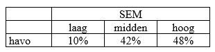
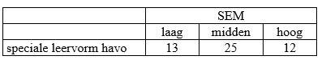

```{r, echo = FALSE, results = "hide"}
include_supplement("uu-Critical-value-802-nl-tabel.jpg", recursive = TRUE)
```

```{r, echo = FALSE, results = "hide"}
include_supplement("uu-Critical-value-802-nl-tabel2.jpg", recursive = TRUE)
```


Question
========
  
Van havo-leerlingen is de verdeling naar Sociaal Economisch Milieu (SEM) bekend. Deze is te zien in onderstaande tabel:



Een decaan wil weten of deze verhouding net zo ligt bij de bezoekers van een speciale leervorm van de havo. Hiertoe trekt hij aselect een steekproef van vijftig ‘speciale leervormers’. Het aantal leerlingen per SEM-categorie is te zien in onderstaande tabel. 



De decaan wil de hypothese toetsen dat de herkomst van de leerlingen uit de verschillende milieus op de speciale leervorm havo gelijk is aan die op de gewone havo. Kan de decaan de gestelde hypothese bij α = .05 verwerpen?
  
Answerlist
----------
* Nee, want $\chi^2 $ < $\chi^2 $ kritiek
* Nee, want $\chi^2 $ > $\chi^2 $ kritiek
* Ja, want $\chi^2 $ < $\chi^2 $ kritiek
* Ja, want want $\chi^2 $ > $\chi^2 $ kritiek

Solution
========


Answerlist
========


Meta-information
================
exname: uu-Critical-value-802-nl.Rmd
extype: schoice
exsolution: 0001
exsection: Inferential Statistics/NHST/Significance level/Critical value
exextra[Type]: Interpretating output
exextra[Language]: Dutch
exextra[Level]: Statistical Literacy
