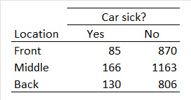

```{r, echo = FALSE, results = "hide"}
include_supplement("uu-Critical-value-803-nl-tabel.jpg", recursive = TRUE)
```

```{r, echo = FALSE, results = "hide"}
include_supplement("uu-Critical-value-803-nl-tabel2.jpg", recursive = TRUE)
```

Question
========
  
One study shows that where a passenger sits on the bus (in the front, middle, or back) has an effect on the likelihood of someone getting car sickness (Griffin & Turner, 1999). An experiment is being conducted in the Netherlands to see if the results apply here as well. The table below shows the results of the experiment.



SPSS is used to analyze the data. Some of the SPSS output is shown below. What is the conclusion of this experiment at $\alpha = .01$ ?


  
Answerlist
----------
* Reject H0, because the observed value of the test quantity is greater than the critical value (= 5.99).
* Reject H0, because the observed value of the test quantity is greater than the critical value (= 9.21).
* Do not reject H0 because the observed value of the test quantity is greater than the critical value (= 11.34).
* Do not reject H0 because the observed value of the test quantity is less than the critical value (= 16.81). 


Solution
========
  


Answerlist
========

Meta-information
================
exname: uu-Critical-value-803-en
extype: schoice
exsolution: 0100
exsection: Inferential Statistics/NHST/Significance level/Critical value
exextra[ID]: 52cc4
exextra[Type]: Interpretating output
exextra[Program]: SPSS
exextra[Language]: English
exextra[Level]: Statistical Literacy
