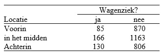
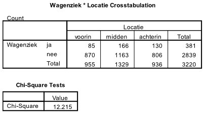

```{r, echo = FALSE, results = "hide"}
include_supplement("uu-Critical-value-803-nl-tabel.jpg", recursive = TRUE)
```

```{r, echo = FALSE, results = "hide"}
include_supplement("uu-Critical-value-803-nl-tabel2.jpg", recursive = TRUE)
```


Question
========
  
Uit een onderzoek blijkt dat de plek waar een passagier in de bus zit (voorin, in het midden, of achterin) effect heeft op de kans dat iemand wagenziekte krijgt (Griffin & Turner, 1999). Een experiment wordt uitgevoerd in Nederland om te kijken of de resultaten ook hier gelden. In de onderstaande tabel staan de resultaten van het experiment.



SPSS wordt gebruikt om de data te analyseren. Een deel van de SPSS output staat hieronder. Wat is de conclusie van dit experiment bij $\alpha = .01$ ?


  
Answerlist
----------
* H0 verwerpen, want de geobserveerde waarde van de toetsingsgrootheid is groter dan de kritieke waarde (= 5.99). 
* H0 verwerpen, want de geobserveerde waarde van de toetsingsgrootheid is groter dan de kritieke waarde (= 9.21). 
* H0 niet verwerpen, want de geobserveerde waarde van de toetsingsgrootheid is groter dan de kritieke waarde (= 11.34). 
* H0 niet verwerpen, want de geobserveerde waarde van de toetsingsgrootheid is kleiner dan de kritieke waarde (= 16.81). 


Solution
========
  


Answerlist
========


Meta-information
================
exname: uu-Critical-value-803-nl.Rmd
extype: schoice
exsolution: 0100
exsection: Inferential Statistics/NHST/Significance level/Critical value
exextra[ID]: d5e42
exextra[Type]: Interpretating output
exextra[Program]: SPSS
exextra[Language]: Dutch
exextra[Level]: Statistical Literacy
