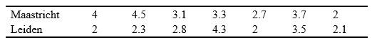

```{r, echo = FALSE, results = "hide"}
include_supplement("uu-Critical-value-805-nl-tabel.jpg", recursive = TRUE)
```

Question
========
A survey is being sent to students for a study on environmental pollution at the university that Maastricht University is commissioning. The survey contains questions asking students' opinions about the environment. At Leiden University, some students also participated in this survey. The data show that the distribution of scores is not normal. 



Are there systematic differences between the environmental awareness scores of Maastricht and Leiden in $\alpha = .05$ ? 
Answerlist
----------
* Yes, because 15 is greater than the critical value of 8.
* Yes, because 6 is greater than the critical value of 2.
* TRUE, because 6 is greater than the critical value of 2.
* TRUE, because 15 is greater than the critical value of 8. 

Solution
========
  


Answerlist
========

Meta-information
================
exname: uu-Critical-value-805-en
extype: schoice
exsolution: 0001
exsection: Inferential Statistics/NHST/Significance level/Critical value
exextra[Type]: Interpretating output
exextra[Program]: SPSS
exextra[Language]: English
exextra[Level]: Statistical Literacy
