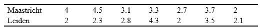

```{r, echo = FALSE, results = "hide"}
include_supplement("uu-Critical-value-805-nl-tabel.jpg", recursive = TRUE)
```


Question
========
Voor een onderzoek naar milieuvervuiling op de universiteit, dat de Universiteit van Maastricht laat uitvoeren, wordt een enquête naar studenten gestuurd. In de enquête staan vragen waarin de mening van de studenten gevraagd wordt over het milieu. Aan de Universiteit van Leiden hebben ook enkele studenten meegedaan met dit onderzoek. Uit de data blijkt dat de verdeling van de scores niet normaal is. 



Zijn er systematische verschillen tussen de milieubewustheidscores van Maastricht en Leiden bij $\alpha = .05$ ?
  
Answerlist
----------
* Ja, want 15 is groter dan de kritieke waarde van 8.
* Ja, want 6 is groter dan de kritieke waarde van 2. 
* Nee, want 6 is groter dan de kritieke waarde van 2. 
* Nee, want 15 is groter dan de kritieke waarde van 8. 


Solution
========
  


Answerlist
========


Meta-information
================
exname: uu-Critical-value-805-nl.Rmd
extype: schoice
exsolution: 0001
exsection: Inferential Statistics/NHST/Significance level/Critical value
exextra[Type]: Interpretating output
exextra[Program]: SPSS
exextra[Language]: Dutch
exextra[Level]: Statistical Literacy
