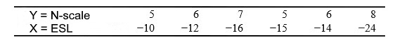
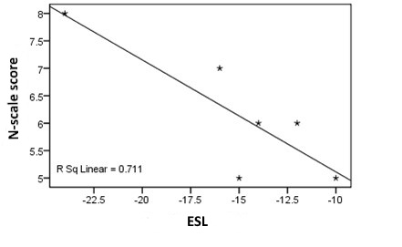

```{r, echo = FALSE, results = "hide"}
include_supplement("uu-Critical-value-806-nl-tabel.jpg", recursive = TRUE)
```

```{r, echo = FALSE, results = "hide"}
include_supplement("uu-Critical-value-806-nl-tabel2.jpg", recursive = TRUE)
```

Question
========
  
Researchers at the Open University Netherlands have written an article entitled "Relationship between ESL and the Psychological Characteristics Neuroticism, Self-efficacy and Coping." To measure neuroticism, the N scale of the ABV (Amsterdam Biographical Questionnaire) is used. The scores range from 1 to 10.

Suppose that ESL is measured by counting the number of months between the actual time of completion and the time of exit (e.g. -8 means that the student left school 8 months before studies were to be completed).

Below are the collected data of 6 students from Eindhoven.




We also know the following: SSX = 6.83, SSY = 116.83 and SP = -23.83.

The following scatterplot belongs to the above data.




Is there a significant correlation between the variables early abandonment and neuroticism in $\alpha = .05$? 
Answerlist
----------
* No, because r = .84 and that is smaller than the critical value of .707
* No, because r = .711 and that is smaller than the critical value of .811
* Yes, because r = -.84 and that is greater in absolute value than the critical value of .811
* Yes, because r = -.711 and that is greater in absolute value than the critical value of .707

Solution
========
  


Answerlist
========

Meta-information
================
exname: uu-Critical-value-806-en
extype: schoice
exsolution: 0010
exsection: Inferential Statistics/NHST/Significance level/Critical value
exextra[Type]: Interpretating output
exextra[Program]: SPSS
exextra[Language]: English
exextra[Level]: Statistical Literacy
