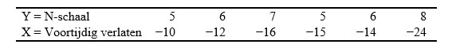
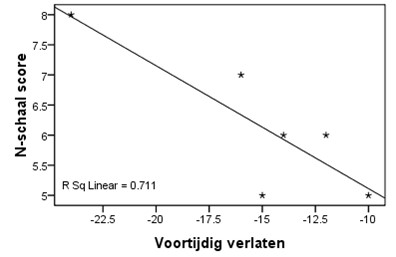

```{r, echo = FALSE, results = "hide"}
include_supplement("uu-Critical-value-806-nl-tabel.jpg", recursive = TRUE)
```

```{r, echo = FALSE, results = "hide"}
include_supplement("uu-Critical-value-806-nl-tabel2.jpg", recursive = TRUE)
```


Question
========
  
Onderzoekers aan de Open Universiteit Nederland hebben een artikel geschreven met de titel “Relatie tussen Voortijdig Schoolverlaten en de Psychologische Kenmerken Neuroticisme, Self-efficacy en Coping”. Voor het meten van neuroticisme wordt de N-schaal van de ABV (Amsterdamse Biografische Vragenlijst) gebruikt. De scores liggen tussen de 1 en de 10. 

Stel dat voortijdig schoolverlaten gemeten wordt door het aantal maanden te tellen tussen het eigenlijke moment van afronding en het moment van verlaten (bijv. −8 betekent dat de leerling 8 maanden voordat de studie afgerond zou worden de school heeft verlaten). 

Hieronder staan de verzamelde data van 6 leerlingen uit Eindhoven.




Ook weten we het volgende: SSX = 6.83, SSY = 116.83 en SP = −23.83.

Het volgende spreidingsdiagram hoort bij de bovenstaande data.




Is er een significante correlatie tussen de variabelen vroegtijdig verlaten en neuroticisme bij $\alpha = .05$?
  
Answerlist
----------
* Nee, want r = .84 en dat is kleiner dan de kritieke waarde van .707 
* Nee, want r = .711 en dat is kleiner dan de kritieke waarde van .811
* Ja, want r = −.84 en dat is groter in absolute waarde dan de kritieke waarde van .811 
* Ja, want r = −.711 en dat is groter in absolute waarde dan de kritieke waarde van .707


Solution
========
  


Answerlist
========


Meta-information
================
exname: uu-Critical-value-806-nl.Rmd
extype: schoice
exsolution: 0010
exsection: Inferential Statistics/NHST/Significance level/Critical value
exextra[ID]: 163ec
exextra[Type]: Interpretating output
exextra[Program]: SPSS
exextra[Language]: Dutch
exextra[Level]: Statistical Literacy
