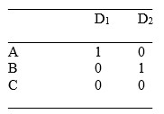

```{r, echo = FALSE, results = "hide"}
include_supplement("uu-Dummies-802-nl-tabel.jpg", recursive = TRUE)
```


Question
========
Bij proefpersonen wordt afname van depressiviteit gemeten op een continue schaal (Y). Men is geïnteresseerd in de effecten van drie soorten van therapieën: A, B of C, maar men meet ook achtergrondvariabelen $X_{1}$ en $X_{2}$. Om de afname van depressiviteit te voorspellen worden voor therapie twee dummy-variabelen gemaakt:



De regressievergelijking voor Y is: $\hat{Y}$ = 6.0 - 1.2$D_{1}$ + 1.4$D_{2}$ + 2$X_{1}$ +3$X_{2}$


Bij de keuze voor de twee dummy-variabelen is een van de therapieën referentiecategorie geworden. Indien andere dummy-variabelen worden gekozen dan de twee die gekozen zijn in Vraag 6, dan…

Answerlist
----------
* verandert de geschatte afname van een persoon.
* verandert de constante (het intercept).
* veranderen de B-waarden van de X-variabelen.
* meer dan 1 van de drie alternatieven a), b) en c) is waar.


Solution
========


Meta-information
================
exname: uu-Dummies-802-nl
extype: schoice
exsolution: 0100
exsection: Inferential Statistics/Regression/Dummies
exextra[ID]: 95001
exextra[Type]: Case
exextra[Language]: Dutch
exextra[Level]: Statistical Literacy