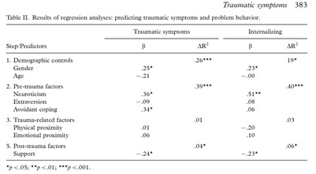

```{r, echo = FALSE, results = "hide"}
include_supplement("uu-Dummies-803-nl-tabel.jpg", recursive = TRUE)
```

Question
========
The table below is from the article by Dekovic et al. (2008), Factors associated with traumatic symptoms and internalizing problems among adolescents who experienced a traumatic event.



The variable physical proximity has three response options: low, medium and high. Looking at the table above, what might be a legitimate criticism of the way the analysis was conducted and/or reported?

Answerlist
----------
* The researchers would have been better off centering the variable physical proximity first before including it in the analysis.
* The researchers would have been better off including the variable physical proximity first, and only then demographic control variables.
* The researchers would have been better off including dummies in the analysis for the variable physical proximity.
* There really should have been an asterisk after the beta of physical proximity (.01).


Solution
========
Physical proximity is a categorical variable. To include categorical variables in a regression analysis, dummies of them must be created.

Meta-information
================
exname: uu-Dummies-803-en
extype: schoice
exsolution: 0010
exsection: Inferential Statistics/Regression/Dummies
exextra[Type]: Interpretating output
exextra[Program]: SPSS
exextra[Language]: English
exextra[Level]: Statistical Literacy