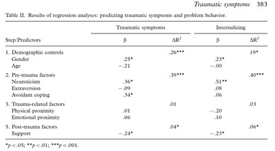

```{r, echo = FALSE, results = "hide"}
include_supplement("uu-Dummies-803-nl-tabel.jpg", recursive = TRUE)
```


Question
========
Onderstaande tabel komt uit het artikel van Dekovic et al. (2008), Factors associated with traumatic symptoms and internalizing problems among adolescents who experienced a traumatic event.



De variabele physical proximity heeft drie antwoordmogelijkheden: laag, midden en hoog. Wat zou een terecht punt van kritiek kunnen zijn op de manier waarop de analyse is uitgevoerd en/ of gerapporteerd als je kijkt naar bovenstaande tabel?

Answerlist
----------
* De onderzoekers hadden beter de variabele physical proximity eerst kunnen centreren voordat deze werd meegenomen in de analyse.
* De onderzoekers hadden beter eerst de variabele physical proximity kunnen meenemen, en daarna pas demografische controle variabelen.
* De onderzoekers hadden beter dummy’s in de analyse mee kunnen nemen voor de variabele physical proximity.
* Er had eigenlijk een sterretje moeten staan achter de beta van physical proximity (.01).


Solution
========
Physical proximity is een categoriale variabele. Om categoriale variabelen op te nemen in een regressieanalyse moeten er dummy’s van gemaakt worden.


Meta-information
================
exname: uu-Dummies-803-nl
extype: schoice
exsolution: 0010
exsection: Inferential Statistics/Regression/Dummies
exextra[ID]: ca376
exextra[Type]: Interpretating output
exextra[Program]: SPSS
exextra[Language]: Dutch
exextra[Level]: Statistical Literacy