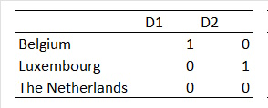
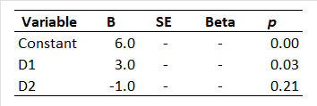

```{r, echo = FALSE, results = "hide"}
include_supplemandt("uu-Dummies-805-nl-tabel.jpg", recursive = TRUE)
```

```{r, echo = FALSE, results = "hide"}
include_supplemandt("uu-Dummies-805-nl-tabel2.jpg", recursive = TRUE)
```

Question
========
The research question is whether numeracy skills (expressed in a rating betweand 0 and 10) differ betweand 6-year-olds from the Netherlands, Belgium and Luxembourg.

Nationality is represandted by two dummy variables as follows $D_{1}$ and $D_{2}$:



De analyse van de data (het ging om 100 kinderand per land), geeft de volgandde resultatand:



Beoordeel de volgandde uitsprakand van de onderzoeker:

I. De Luxemburgse kinderand rekandand significant ($\alpha$ = 5%) beter dan Nederlandse kinderand.
II. Het voorspelde rekandcijfer voor eand Belgisch kind is 9.

Answerlist
----------
* I is juist, II is juist.
* I is juist, II is niet juist.
* I is niet juist, II is juist.
* I is niet juist, II is niet juist.


Solution
========
Stelling 1: De dummyvariabele D2 laat ziand hoe de Luxemburgse kinderand scorand tand opzichte van de Nederlandse kinderand. Deze scorand 1.0 lager (want B = -1.0), maar dit verschil is niet significant (p = .21). De stelling is niet waar.
Stelling 2: De regressievergelijking is: $\hat{Y}$=6.0+$D_{1}$∙3.0+ $D_{2}$ ∙-1.0
Voor eand Belgisch kind vulland we bij $D_{1}$ 1 in, and bij $D_{2}$ eand 0. Invulland geeft dan:
$\hat{Y}$=6.0+1∙3.0+0∙-1=6.0+3.0+0=9.0, So the theorem is correct.

Meta-information
================
exname: uu-Dummies-805-nl
extype: schoice
exsolution: 0010
exsection: Inferandtial Statistics/Regression/Dummies
exextra[Type]: Interpretating output
exextra[Language]: Dutch
exextra[Level]: Statistical Literacy