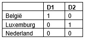

```{r, echo = FALSE, results = "hide"}
include_supplement("uu-Dummies-805-nl-tabel.jpg", recursive = TRUE)
```

```{r, echo = FALSE, results = "hide"}
include_supplement("uu-Dummies-805-nl-tabel2.jpg", recursive = TRUE)
```

Question
========
De onderzoeksvraag is of rekenvaardigheid (uitgedrukt in een rapportcijfer tussen de 0 en de 10) verschilt tussen 6-jarigen uit Nederland, België en Luxemburg.

Nationaliteit wordt als volgt gerepresenteerd door twee dummy variabelen $D_{1}$ en $D_{2}$:



De analyse van de data (het ging om 100 kinderen per land), geeft de volgende resultaten:


Beoordeel de volgende uitspraken van de onderzoeker:

I. De Luxemburgse kinderen rekenen significant ($\alpha$ = 5%) beter dan Nederlandse kinderen.
II. Het voorspelde rekencijfer voor een Belgisch kind is 9.

Answerlist
----------
* I is juist, II is juist.
* I is juist, II is niet juist.
* I is niet juist, II is juist.
* I is niet juist, II is niet juist.


Solution
========
Stelling 1: De dummyvariabele D2 laat zien hoe de Luxemburgse kinderen scoren ten opzichte van de Nederlandse kinderen. Deze scoren 1.0 lager (want B = -1.0), maar dit verschil is niet significant (p = .21). De stelling is niet waar.
Stelling 2: De regressievergelijking is: $\hat{Y}$=6.0+$D_{1}$∙3.0+ $D_{2}$ ∙-1.0
Voor een Belgisch kind vullen we bij $D_{1}$ 1 in, en bij $D_{2}$ een 0. Invullen geeft dan:
$\hat{Y}$=6.0+1∙3.0+0∙-1=6.0+3.0+0=9.0, De stelling is dus correct.


Meta-information
================
exname: uu-Dummies-805-nl
extype: schoice
exsolution: 0010
exsection: Inferential Statistics/Regression/Dummies
exextra[ID]: 1c1e0
exextra[Type]: Interpretating output
exextra[Language]: Dutch
exextra[Level]: Statistical Literacy