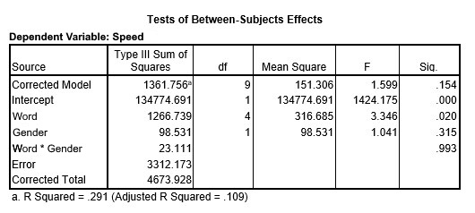

```{r, echo = FALSE, results = "hide"}
include_supplement("uu-Effect-size-801-nl-tabel.jpg", recursive = TRUE)
```

Question
========

Researchers at the Open University Netherlands have written an article entitled "Relationship between ESL and the Psychological Characteristics Neuroticism, Self-efficacy and Coping." To measure neuroticism, the N scale of the ABV (Amsterdam Biographical Questionnaire) is used. The scores range from 1 to 10.

The gender of the assessor is also included in the analysis of the data. Care was taken to ensure that there were at least three participants of each sex in each group. Part of the SPSS output is shown below.



What is the value of the effect size of the Word factor?

Answerlist
----------

* 0.029
* 0.40
* 0.28
* 3.35

Solution
========

Meta-information
================
exname: uu-Effect-size-801-en
extype: schoice
exsolution: 0010
exsection: Inferential Statistics/Effect size
exextra[Type]: Interpretating output
exextra[Program]: SPSS
exextra[Language]: English
exextra[Level]: Statistical Literacy
