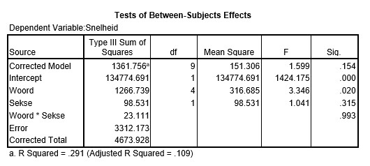

```{r, echo = FALSE, results = "hide"}
include_supplement("uu-Effect-size-801-nl-tabel.jpg", recursive = TRUE)
```

Question
========

Onderzoekers aan de Open Universiteit Nederland hebben een artikel geschreven met de titel "Relatie tussen Voortijdig Schoolverlaten en de Psychologische Kenmerken Neuroticisme, Self-efficacy en Coping". Voor het meten van neuroticisme wordt de N-schaal van de ABV (Amsterdamse Biografische Vragenlijst) gebruikt. De scores liggen tussen de 1 en de 10.

In de analyse van de gegevens wordt tevens de sekse van de beoordelaar meegenomen. Er werd voor gezorgd dat er minstens drie deelnemers van elke sekse in iedere groep zaten. Een deel van de SPSS-output staat hieronder.



Wat is de waarde van de effectgrootte van de factor Woord?

Answerlist
----------

* 0.029
* 0.40
* 0.28
* 3.35

Solution
========

Answerlist
----------


Meta-information
================

exname: uu-Effect-size-801-nl.Rmd 
extype: schoice 
exsolution: 0010 
exsection: Inferential Statistics/Effect size 
exextra[Type]: Interpretating output 
exextra[Program]: SPSS 
exextra[Language]: Dutch 
exextra[Level]: Statistical Literacy
