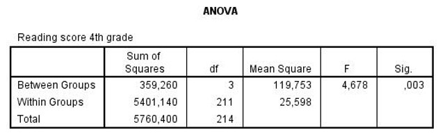

```{r, echo = FALSE, results = "hide"}
include_supplement("uu-Effect-size-811-nl-tabel.jpg", recursive = TRUE)
```

Question
========
  
Several schools in inner-city New York use different methods for teaching reading to children in grades 2 through 4 (each school has its own method). At the end of grade 4, the children's reading scores are determined and compared across schools. Some of the SPSS output is shown below. 



Since the results are significant, the researcher wants to report the effect size. What is the value of the effect size of this test? 
Answerlist
----------
* 4.7%
* 6.2%
* 93.8%
* 95.3%


Solution
========

Meta-information
================
exname: uu-Effect-size-811-en
extype: schoice
exsolution: 0100
exsection: Inferential Statistics/Effect size
exextra[Type]: Case
exextra[Program]: SPSS
exextra[Language]: English
exextra[Level]: Statistical Literacy
