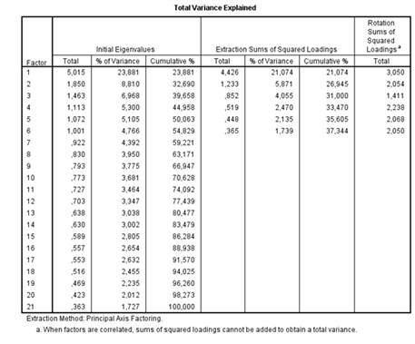

```{r, echo = FALSE, results = "hide"}
include_supplement("uu-Eigenvalues-031-nl-tabel.jpg", recursive = TRUE)
```

Question
========
  
'So many demands are placed on modern parents that they can easily develop fear of failure' (Wed., Jan. 7, 2014). In a study of parents' insecurities and fear of failure, a collection of 21 relevant items was presented to a random sample of parents. Respondents were required to indicate the degree to which each item applied (1 = not at all applicable to me through 7 = completely applicable to me).

Example: The responsibility of parenting is hard on me.

See below output of a principal axis factor analysis (PAF) with skewed (oblimin) rotation for 21 items on parental uncertainty and fear of failure.

How many factors do you select based on the Eigenvalue greater than 1 criterion?


  
Answerlist
----------
* 1
* 2
* 3
* More than 4

Solution
========
  
Explanation: With the eigenvalue criterion, you select the factors with an eigenvalue greater than 1. The Total column under the Initial Eigenvalues heading shows that 6 factors have an eigenvalue greater than 1. Thus, in this study, 6 factors (more than 4) are selected based on the eigenvalue criterion.

Meta-information
================
exname: uu-Eigenvalues-031-en
extype: schoice
exsolution: 0001
exsection: Factor analysis/Eigenvalues
exextra[Type]: Interpreting output
exextra[Program]: SPSS
exextra[Language]: English
exextra[Level]: Statistical Literacy
