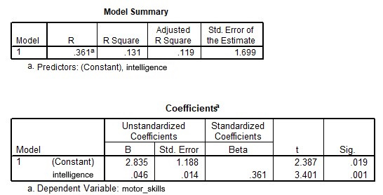

```{r, echo = FALSE, results = "hide"}
include_supplement("uu-Equation-800-nl-tabel.jpg", recursive = TRUE)
```

Question
========
  
The researcher also adds the variable intelligence to the study. He sets up a regression equation to predict deaf children's motor development with their intelligence. The following SPSS output accompanies the regression analysis. 



What regression equation should the researcher construct based on the output? 
Answerlist
----------
* Yp = 1.188 + 0.014 - motor development
* Yp = 2.835 + 0.046 - motor development
* Yp = 2.835 + 0.046 - intelligence
* Yp = 1.188 + 0.014 - intelligence


Solution
========

Meta-information
================
exname: uu-Equation-800-en
extype: schoice
exsolution: 0010
exsection: Inferential Statistics/Regression/Equation
exextra[ID]: d5e73
exextra[Type]: Interpretating output
exextra[Program]: SPSS
exextra[Language]: English
exextra[Level]: Statistical Literacy
