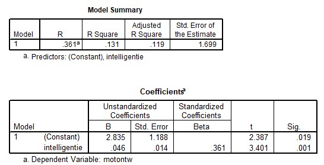

```{r, echo = FALSE, results = "hide"}
include_supplement("uu-Equation-800-nl-tabel.jpg", recursive = TRUE)
```


Question
========
  
De onderzoeker voegt ook de variabele intelligentie toe aan het onderzoek. Hij stelt een regressievergelijking op om de motorische ontwikkeling van dove kinderen te voorspellen met hun intelligentie. De volgende SPSS-output hoort bij de regressieanalyse. 



Welke regressievergelijking moet de onderzoeker opstellen op basis van de output?
  
Answerlist
----------
* Yp = 1.188 + 0.014 · motorische ontwikkeling
* Yp = 2.835 + 0.046 · motorische ontwikkeling
* Yp = 2.835 + 0.046 · intelligentie
* Yp = 1.188 + 0.014 · intelligentie


Solution
========
  


Meta-information
================
exname: uu-Equation-800-nl.Rmd
extype: schoice
exsolution: 0010
exsection: Inferential Statistics/Regression/Equation
exextra[Type]: Interpretating output
exextra[Program]: SPSS
exextra[Language]: Dutch
exextra[Level]: Statistical Literacy
